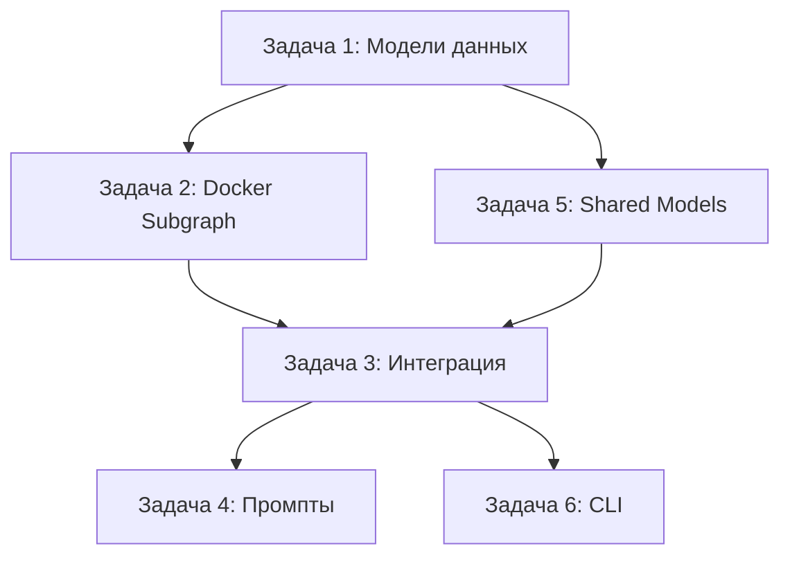

# Docker Integration - Упрощенный план реализации

## 🎯 Общая структура задач



**Упрощение:** Убрана вся функциональность работы с артефактами (APK, JAR и т.д.). Оставлена только проверка сборки с возвратом статуса, команд и ошибок.

---

## 📋 Задача 1: Создание моделей данных для Docker

**Приоритет:** 🔴 Критический (блокирует остальные задачи)
**Время:** 1-2 часа
**Файлы:**
- `koog-service/src/main/kotlin/ru/andvl/chatter/koog/model/docker/DockerModels.kt` (создать новый)

### Что нужно сделать:

1. **Создать новый файл `DockerModels.kt`** в пакете `ru.andvl.chatter.koog.model.docker`

2. **Реализовать следующие модели:**

```kotlin
package ru.andvl.chatter.koog.model.docker

import ai.koog.agents.core.tools.annotations.LLMDescription
import kotlinx.serialization.SerialName
import kotlinx.serialization.Serializable

@LLMDescription("Docker environment configuration for building and running the project")
@Serializable
data class DockerEnvModel(
    @property:LLMDescription("Base Docker image to use for building (e.g., node:18-alpine, python:3.9-slim). Field name: base_image")
    @SerialName("base_image")
    val baseImage: String,
    @property:LLMDescription("Command to build/install dependencies (e.g., npm install, pip install -r requirements.txt). Field name: build_command")
    @SerialName("build_command")
    val buildCommand: String,
    @property:LLMDescription("Command to run the application (e.g., npm start, python app.py). Field name: run_command")
    @SerialName("run_command")
    val runCommand: String,
    @property:LLMDescription("Main application port if it's a web service (e.g., 3000, 8080). Optional. Field name: port")
    @SerialName("port")
    val port: Int? = null,
    @property:LLMDescription("Additional notes about Docker configuration or requirements. Optional. Field name: additional_notes")
    @SerialName("additional_notes")
    val additionalNotes: String? = null
)

@LLMDescription("Result of Docker build attempt with status, logs and metrics")
@Serializable
data class DockerBuildResult(
    @property:LLMDescription("Build status: SUCCESS, FAILED, or NOT_ATTEMPTED. Field name: build_status")
    @SerialName("build_status")
    val buildStatus: String,
    @property:LLMDescription("Last 20 lines of build logs for debugging. Field name: build_logs")
    @SerialName("build_logs")
    val buildLogs: List<String> = emptyList(),
    @property:LLMDescription("Size of the built Docker image if successful. Optional. Field name: image_size")
    @SerialName("image_size")
    val imageSize: String? = null,
    @property:LLMDescription("Build duration in seconds. Optional. Field name: build_duration_seconds")
    @SerialName("build_duration_seconds")
    val buildDurationSeconds: Int? = null,
    @property:LLMDescription("Error message if build failed. Optional. Field name: error_message")
    @SerialName("error_message")
    val errorMessage: String? = null
)

@LLMDescription("Complete Docker build information including environment and results")
@Serializable
data class DockerInfoModel(
    @property:LLMDescription("Docker environment configuration used for build. Field name: docker_env")
    @SerialName("docker_env")
    val dockerEnv: DockerEnvModel,
    @property:LLMDescription("Build execution result with status and logs. Field name: build_result")
    @SerialName("build_result")
    val buildResult: DockerBuildResult,
    @property:LLMDescription("Whether Dockerfile was auto-generated or already existed. Field name: dockerfile_generated")
    @SerialName("dockerfile_generated")
    val dockerfileGenerated: Boolean = false,
    @property:LLMDescription("Content of generated Dockerfile if applicable. Optional. Field name: generated_dockerfile_content")
    @SerialName("generated_dockerfile_content")
    val generatedDockerfileContent: String? = null
)
```

3. **Расширить существующую модель `ToolChatResponse`**

Файл: `koog-service/src/main/kotlin/ru/andvl/chatter/koog/model/tool/ToolIntermediateModels.kt`

Добавить поле в `ToolChatResponse`:
```kotlin
@property:LLMDescription("Docker build information if Docker build was attempted. Optional. Field name: docker_info")
@SerialName("docker_info")
val dockerInfo: DockerInfoModel? = null
```

4. **Расширить `GithubRepositoryAnalysisModel.SuccessAnalysisModel`**

В том же файле `ToolIntermediateModels.kt`:
```kotlin
@property:LLMDescription("Docker environment configuration if project can be containerized. Set to null if Docker is not applicable. Field name: docker_env")
@SerialName("docker_env")
val dockerEnv: DockerEnvModel? = null
```

### Критерии готовности:
- [x] Файл `DockerModels.kt` создан с тремя моделями
- [x] Все модели имеют `@Serializable`, `@SerialName` и `@LLMDescription` аннотации
- [x] Все поля имеют `@property:LLMDescription` с описанием и названием поля
- [x] `ToolChatResponse` расширен полем `dockerInfo` с LLMDescription
- [x] `GithubRepositoryAnalysisModel.SuccessAnalysisModel` расширен полем `dockerEnv` с LLMDescription
- [x] Импорт `ai.koog.agents.core.tools.annotations.LLMDescription` добавлен
- [x] Код компилируется без ошибок

---

## 📋 Задача 2: Реализация Docker Subgraph

**Приоритет:** 🟠 Высокий
**Время:** 4-5 часов
**Зависимости:** Задача 1 (модели)
**Файлы:**
- `koog-service/src/main/kotlin/ru/andvl/chatter/koog/agents/mcp/subgraphs/subgraphDocker.kt` (создать новый)

### Что нужно сделать:

1. **Создать новый файл `subgraphDocker.kt`** с основной структурой:

```kotlin
package ru.andvl.chatter.koog.agents.mcp.subgraphs

import ai.koog.agents.core.agent.entity.createStorageKey
import ai.koog.agents.core.dsl.builder.*
import org.slf4j.LoggerFactory
import ru.andvl.chatter.koog.model.docker.*
import ru.andvl.chatter.koog.model.tool.*
import java.io.File

private val dockerAnalysisKey = createStorageKey<GithubRepositoryAnalysisModel.SuccessAnalysisModel>("docker-analysis")
private val logger = LoggerFactory.getLogger("docker-subgraph")

internal fun AIAgentGraphStrategyBuilder<GithubRepositoryAnalysisModel.SuccessAnalysisModel, ToolChatResponse>.subgraphDocker():
        AIAgentSubgraphDelegate<GithubRepositoryAnalysisModel.SuccessAnalysisModel, ToolChatResponse> =
    subgraph("docker-build") {
        val nodeDockerSystemCheck by nodeDockerSystemCheck()
        val nodeDockerBuild by nodeDockerBuild()
        val nodeDockerResult by nodeDockerResult()

        edge(nodeStart forwardTo nodeDockerSystemCheck)
        edge(nodeDockerSystemCheck forwardTo nodeDockerBuild)
        edge(nodeDockerBuild forwardTo nodeDockerResult)
        edge(nodeDockerResult forwardTo nodeFinish)
    }
```

2. **Реализовать Node 1: Проверка Docker системы**

```kotlin
private fun AIAgentSubgraphBuilderBase<GithubRepositoryAnalysisModel.SuccessAnalysisModel, ToolChatResponse>.nodeDockerSystemCheck() =
    node<GithubRepositoryAnalysisModel.SuccessAnalysisModel, Boolean>("docker-system-check") { analysisResult ->
        storage.set(dockerAnalysisKey, analysisResult)

        logger.info("Checking Docker system availability...")

        val dockerAvailable = try {
            val process = ProcessBuilder("docker", "--version").start()
            val exitCode = process.waitFor()
            logger.info("Docker version check exit code: $exitCode")
            exitCode == 0
        } catch (e: Exception) {
            logger.warn("Docker not available: ${e.message}")
            false
        }

        logger.info("Docker available: $dockerAvailable")
        dockerAvailable
    }
```

3. **Реализовать Node 2: Docker Build (упрощенная версия)**

```kotlin
private fun AIAgentSubgraphBuilderBase<GithubRepositoryAnalysisModel.SuccessAnalysisModel, ToolChatResponse>.nodeDockerBuild() =
    node<Boolean, DockerBuildResult>("docker-build") { dockerAvailable ->
        val analysisResult = storage.get(dockerAnalysisKey)!!

        if (!dockerAvailable || analysisResult.dockerEnv == null) {
            return@node DockerBuildResult(
                buildStatus = "NOT_ATTEMPTED",
                errorMessage = "Docker not available or not configured"
            )
        }

        val dockerEnv = analysisResult.dockerEnv
        logger.info("Starting Docker build with base image: ${dockerEnv.baseImage}")

        var tempDir: File? = null
        try {
            // 1. Создать временную директорию
            tempDir = createTempDir("docker-build-")
            logger.info("Created temp directory: ${tempDir.absolutePath}")

            // 2. Извлечь URL репозитория
            val repoUrl = extractRepoUrl(analysisResult.freeFormAnswer)
            if (repoUrl == null) {
                logger.error("Could not extract repository URL from analysis")
                return@node DockerBuildResult(
                    buildStatus = "FAILED",
                    errorMessage = "Could not extract repository URL from analysis"
                )
            }

            logger.info("Cloning repository: $repoUrl")

            // 3. Клонировать репозиторий
            val cloneProcess = ProcessBuilder("git", "clone", "--depth", "1", repoUrl, tempDir.absolutePath)
                .redirectErrorStream(true)
                .start()

            val cloneOutput = cloneProcess.inputStream.bufferedReader().readText()
            val cloneExitCode = cloneProcess.waitFor()

            if (cloneExitCode != 0) {
                logger.error("Failed to clone repository. Exit code: $cloneExitCode")
                return@node DockerBuildResult(
                    buildStatus = "FAILED",
                    errorMessage = "Failed to clone repository",
                    buildLogs = cloneOutput.lines().takeLast(5)
                )
            }

            logger.info("Repository cloned successfully")

            // 4. Создать Dockerfile если отсутствует
            val dockerFile = tempDir.resolve("Dockerfile")
            val dockerfileGenerated = !dockerFile.exists()

            if (dockerfileGenerated) {
                val dockerfileContent = generateDockerfile(dockerEnv)
                dockerFile.writeText(dockerfileContent)
                logger.info("Generated Dockerfile:\n$dockerfileContent")
            } else {
                logger.info("Using existing Dockerfile")
            }

            // 5. Запустить Docker build
            val startTime = System.currentTimeMillis()
            val imageName = "chatter-test-${System.currentTimeMillis()}"

            logger.info("Starting Docker build with image name: $imageName")

            val buildProcess = ProcessBuilder(
                "docker", "build",
                "-t", imageName,
                "--no-cache",
                "."
            )
                .directory(tempDir)
                .redirectErrorStream(true)
                .start()

            val buildLogs = mutableListOf<String>()
            buildProcess.inputStream.bufferedReader().use { reader ->
                var line: String?
                while (reader.readLine().also { line = it } != null) {
                    line?.let {
                        buildLogs.add(it)
                        logger.info("Docker build: $it")
                    }
                }
            }

            val buildExitCode = buildProcess.waitFor()
            val duration = ((System.currentTimeMillis() - startTime) / 1000).toInt()

            logger.info("Docker build completed with exit code: $buildExitCode, duration: ${duration}s")

            // 6. Получить размер образа (если успешно)
            val imageSize = if (buildExitCode == 0) {
                getImageSize(imageName)
            } else null

            // 7. Cleanup образа
            if (buildExitCode == 0) {
                try {
                    ProcessBuilder("docker", "rmi", imageName).start().waitFor()
                    logger.info("Cleaned up Docker image: $imageName")
                } catch (e: Exception) {
                    logger.warn("Failed to cleanup Docker image: ${e.message}")
                }
            }

            // 8. Вернуть результат
            DockerBuildResult(
                buildStatus = if (buildExitCode == 0) "SUCCESS" else "FAILED",
                buildLogs = buildLogs.takeLast(20),
                imageSize = imageSize,
                buildDurationSeconds = duration,
                errorMessage = if (buildExitCode != 0) {
                    "Docker build failed with exit code $buildExitCode. Check logs for details."
                } else null
            )

        } catch (e: Exception) {
            logger.error("Docker build error", e)
            DockerBuildResult(
                buildStatus = "FAILED",
                errorMessage = "Exception during Docker build: ${e.message}",
                buildLogs = listOf(e.stackTraceToString().lines().take(10)).flatten()
            )
        } finally {
            // Cleanup temp directory
            tempDir?.let {
                try {
                    it.deleteRecursively()
                    logger.info("Cleaned up temp directory")
                } catch (e: Exception) {
                    logger.warn("Failed to cleanup temp directory: ${e.message}")
                }
            }
        }
    }
```

4. **Реализовать Node 3: Формирование результата**

```kotlin
private fun AIAgentSubgraphBuilderBase<GithubRepositoryAnalysisModel.SuccessAnalysisModel, ToolChatResponse>.nodeDockerResult() =
    node<DockerBuildResult, ToolChatResponse>("docker-result") { buildResult ->
        val analysisResult = storage.get(dockerAnalysisKey)!!

        val dockerInfo = if (analysisResult.dockerEnv != null) {
            DockerInfoModel(
                dockerEnv = analysisResult.dockerEnv,
                buildResult = buildResult,
                dockerfileGenerated = buildResult.buildStatus != "NOT_ATTEMPTED"
            )
        } else null

        ToolChatResponse(
            response = analysisResult.freeFormAnswer +
                if (dockerInfo != null) "\n\n${formatDockerResults(dockerInfo)}" else "",
            shortSummary = analysisResult.shortSummary,
            toolCalls = emptyList(),
            originalMessage = null,
            tokenUsage = null,
            repositoryReview = analysisResult.repositoryReview,
            requirements = null,
            dockerInfo = dockerInfo
        )
    }
```

5. **Реализовать вспомогательные функции**

```kotlin
private fun generateDockerfile(dockerEnv: DockerEnvModel): String {
    return """
FROM ${dockerEnv.baseImage}

WORKDIR /app

# Copy project files
COPY . .

# Build command
RUN ${dockerEnv.buildCommand}

# Expose port if specified
${if (dockerEnv.port != null) "EXPOSE ${dockerEnv.port}" else "# No port specified"}

# Run command
CMD ${dockerEnv.runCommand}
    """.trimIndent()
}

private fun extractRepoUrl(analysis: String): String? {
    val pattern = "https://github\\.com/[\\w.-]+/[\\w.-]+".toRegex()
    return pattern.find(analysis)?.value
}

private fun getImageSize(imageName: String): String? {
    return try {
        val process = ProcessBuilder("docker", "images", "--format", "{{.Size}}", imageName).start()
        if (process.waitFor() == 0) {
            process.inputStream.bufferedReader().readText().trim()
        } else null
    } catch (e: Exception) {
        logger.warn("Failed to get image size: ${e.message}")
        null
    }
}

private fun formatDockerResults(dockerInfo: DockerInfoModel): String {
    val result = dockerInfo.buildResult
    return buildString {
        appendLine("## 🐳 Docker Build Results")
        appendLine()
        appendLine("**Docker Environment:**")
        appendLine("- Base Image: `${dockerInfo.dockerEnv.baseImage}`")
        appendLine("- Build Command: `${dockerInfo.dockerEnv.buildCommand}`")
        appendLine("- Run Command: `${dockerInfo.dockerEnv.runCommand}`")
        if (dockerInfo.dockerEnv.port != null) {
            appendLine("- Port: `${dockerInfo.dockerEnv.port}`")
        }
        if (dockerInfo.dockerEnv.additionalNotes != null) {
            appendLine("- Notes: ${dockerInfo.dockerEnv.additionalNotes}")
        }
        appendLine()

        appendLine("**Build Status:** ${result.buildStatus}")
        if (result.buildDurationSeconds != null) {
            appendLine("**Duration:** ${result.buildDurationSeconds}s")
        }
        if (result.imageSize != null) {
            appendLine("**Image Size:** ${result.imageSize}")
        }
        if (dockerInfo.dockerfileGenerated) {
            appendLine("**Dockerfile:** Generated automatically")
        }

        if (result.errorMessage != null) {
            appendLine()
            appendLine("**Error:**")
            appendLine("```")
            appendLine(result.errorMessage)
            appendLine("```")
        }

        if (result.buildLogs.isNotEmpty()) {
            appendLine()
            appendLine("<details>")
            appendLine("<summary>Build Logs (last 20 lines)</summary>")
            appendLine()
            appendLine("```")
            result.buildLogs.forEach { log ->
                appendLine(log)
            }
            appendLine("```")
            appendLine("</details>")
        }
    }
}
```

### Критерии готовности:
- [x] Файл `subgraphDocker.kt` создан
- [x] Реализованы все 3 ноды
- [x] Сабграф корректно обрабатывает: Docker недоступен, dockerEnv null
- [x] Логирование работает на всех этапах
- [x] Временные директории создаются и очищаются
- [x] Docker образы удаляются после сборки
- [x] Код компилируется

---

## 📋 Задача 3: Интеграция Docker subgraph в основной flow

**Приоритет:** 🟡 Средний
**Время:** 1-2 часа
**Зависимости:** Задачи 1, 2
**Файлы:**
- `koog-service/src/main/kotlin/ru/andvl/chatter/koog/agents/mcp/McpToolUserAgentProvider.kt`

### Что нужно сделать:

1. **Добавить импорт нового сабграфа**

```kotlin
import ru.andvl.chatter.koog.agents.mcp.subgraphs.subgraphDocker
```

2. **Модифицировать стратегию `getGithubAnalysisStrategy()`**

Найти функцию и добавить Docker subgraph:

```kotlin
internal fun getGithubAnalysisStrategy(): AIAgentGraphStrategy<GithubChatRequest, ToolChatResponse> =
    strategy("github-analysis-agent") {
        val initialRequestNode by subgraphGithubLLMRequest()
        val githubAnalysisSubgraph by subgraphGithubAnalyze()
        val dockerSubgraph by subgraphDocker() // НОВЫЙ САБГРАФ

        edge(nodeStart forwardTo initialRequestNode)
        edge(initialRequestNode forwardTo githubAnalysisSubgraph)

        // Условный переход к Docker сабграфу
        edge(githubAnalysisSubgraph forwardTo dockerSubgraph) { result ->
            result is GithubRepositoryAnalysisModel.SuccessAnalysisModel &&
            result.dockerEnv != null
        }

        // Прямое завершение если Docker не нужен
        edge(githubAnalysisSubgraph forwardTo nodeFinish) { result ->
            result is GithubRepositoryAnalysisModel.SuccessAnalysisModel &&
            result.dockerEnv == null ||
            result is GithubRepositoryAnalysisModel.FailedAnalysisModel
        }

        // Docker сабграф завершается в финальную ноду
        edge(dockerSubgraph forwardTo nodeFinish)
    }
```

### Критерии готовности:
- [x] Docker logic integrated into github analysis flow
- [x] Docker build runs when dockerEnv != null
- [x] Docker build skipped when dockerEnv == null
- [x] Docker results added to ToolChatResponse
- [x] Code compiles and runs

---

## 📋 Задача 4: Расширение промптов для Docker detection

**Приоритет:** 🟡 Средний
**Время:** 1-2 часа
**Зависимости:** Задача 1
**Файлы:**
- `koog-service/src/main/kotlin/ru/andvl/chatter/koog/agents/mcp/subgraphs/subgraphGithubAnalyse.kt`

### Что нужно сделать:

1. **Найти `nodeProcessResult` в `subgraphGithubAnalyse.kt`**

2. **Добавить Docker detection секцию в system промпт**

Найти место, где формируется system prompt для финального анализа, и добавить:

```kotlin
val dockerDetectionSection = """

**DOCKER ENVIRONMENT ANALYSIS:**
Analyze if this project can be containerized with Docker:

1. Check for existing Docker configuration:
   - Dockerfile, docker-compose.yml, .dockerignore

2. Identify project type and technology:
   - Node.js: package.json with scripts
   - Python: requirements.txt, setup.py
   - Java: pom.xml (Maven), build.gradle (Gradle)
   - Go: go.mod
   - Ruby: Gemfile
   - PHP: composer.json

3. If suitable for Docker, provide `docker_env`:

   **Node.js projects:**
   - base_image: "node:18-alpine" or "node:20-alpine"
   - build_command: "npm install" or "yarn install"
   - run_command: "npm start" or "node index.js"
   - port: 3000 (or from package.json)

   **Python projects:**
   - base_image: "python:3.9-slim" or "python:3.11-slim"
   - build_command: "pip install -r requirements.txt"
   - run_command: "python app.py" or "gunicorn app:app --bind 0.0.0.0:5000"
   - port: 5000 or 8000

   **Java/Maven projects:**
   - base_image: "maven:3.8-openjdk-11" for build
   - build_command: "mvn clean package"
   - run_command: "java -jar target/*.jar"
   - port: 8080

   **Java/Gradle projects:**
   - base_image: "gradle:7-jdk11" for build
   - build_command: "./gradlew build"
   - run_command: "java -jar build/libs/*.jar"
   - port: 8080

4. Set `docker_env` to **null** if:
   - Pure library/SDK (no runnable application)
   - CLI tool without server component
   - Requires specific hardware/OS features
   - No clear build/run commands

**Example JSON output:**
```json
{
  "docker_env": {
    "base_image": "node:18-alpine",
    "build_command": "npm install",
    "run_command": "npm start",
    "port": 3000,
    "additional_notes": "Requires NODE_ENV=production for production use"
  }
}
```

**Important:** Be conservative - only suggest Docker if clearly applicable.
""".trimIndent()

// Добавить в system промпт перед примером JSON структуры
```

3. **Обновить JSON пример в промпте**

Найти место с примером JSON структуры и убедиться, что включено поле `docker_env`:

```kotlin
val jsonExample = """
**REQUIRED JSON OUTPUT STRUCTURE:**
```json
{
  "free_form_github_analysis": "Comprehensive analysis...",
  "tldr": "Brief summary...",
  "repository_review": { /* if requirements provided */ },
  "docker_env": {
    "base_image": "node:18-alpine",
    "build_command": "npm install",
    "run_command": "npm start",
    "port": 3000,
    "additional_notes": "Optional notes"
  }
}
```

Set `docker_env` to null if Docker is not applicable.
""".trimIndent()
```

### Критерии готовности:
- [x] Docker detection секция добавлена
- [x] Примеры для основных технологий включены
- [x] Четко указано когда возвращать null
- [x] JSON примеры обновлены

---

## 📋 Задача 5: Расширение shared-models для Docker

**Приоритет:** 🟡 Средний
**Время:** 1 час
**Зависимости:** Задача 1
**Файлы:**
- `shared-models/src/main/kotlin/ru/andvl/chatter/shared/models/github/GithubAnalysisResponse.kt`
- `shared-models/src/main/kotlin/ru/andvl/chatter/shared/models/github/DockerModels.kt` (создать)

### Что нужно сделать:

1. **Создать `DockerModels.kt` в shared-models**

```kotlin
package ru.andvl.chatter.shared.models.github

import kotlinx.serialization.SerialName
import kotlinx.serialization.Serializable

@Serializable
data class DockerEnvDto(
    @SerialName("base_image")
    val baseImage: String,
    @SerialName("build_command")
    val buildCommand: String,
    @SerialName("run_command")
    val runCommand: String,
    @SerialName("port")
    val port: Int? = null,
    @SerialName("additional_notes")
    val additionalNotes: String? = null
)

@Serializable
data class DockerBuildResultDto(
    @SerialName("build_status")
    val buildStatus: String,
    @SerialName("build_logs")
    val buildLogs: List<String> = emptyList(),
    @SerialName("image_size")
    val imageSize: String? = null,
    @SerialName("build_duration_seconds")
    val buildDurationSeconds: Int? = null,
    @SerialName("error_message")
    val errorMessage: String? = null
)

@Serializable
data class DockerInfoDto(
    @SerialName("docker_env")
    val dockerEnv: DockerEnvDto,
    @SerialName("build_result")
    val buildResult: DockerBuildResultDto,
    @SerialName("dockerfile_generated")
    val dockerfileGenerated: Boolean = false
)
```

2. **Расширить `GithubAnalysisResponse.kt`**

```kotlin
@Serializable
data class GithubAnalysisResponse(
    @SerialName("analysis")
    val analysis: String,
    @SerialName("tldr")
    val tldr: String,
    @SerialName("tool_calls")
    val toolCalls: List<String> = emptyList(),
    @SerialName("model")
    val model: String? = null,
    @SerialName("usage")
    val usage: TokenUsageDto? = null,
    @SerialName("repository_review")
    val repositoryReview: RepositoryReviewDto? = null,
    @SerialName("requirements")
    val requirements: RequirementsAnalysisDto? = null,
    @SerialName("docker_info")
    val dockerInfo: DockerInfoDto? = null // НОВОЕ ПОЛЕ
)
```

3. **Добавить conversion функции**

В KoogService или подходящем месте:

```kotlin
fun DockerInfoModel.toDto(): DockerInfoDto {
    return DockerInfoDto(
        dockerEnv = dockerEnv.toDto(),
        buildResult = buildResult.toDto(),
        dockerfileGenerated = dockerfileGenerated
    )
}

fun DockerEnvModel.toDto(): DockerEnvDto {
    return DockerEnvDto(
        baseImage = baseImage,
        buildCommand = buildCommand,
        runCommand = runCommand,
        port = port,
        additionalNotes = additionalNotes
    )
}

fun DockerBuildResult.toDto(): DockerBuildResultDto {
    return DockerBuildResultDto(
        buildStatus = buildStatus,
        buildLogs = buildLogs,
        imageSize = imageSize,
        buildDurationSeconds = buildDurationSeconds,
        errorMessage = errorMessage
    )
}
```

### Критерии готовности:
- [x] DTO модели созданы
- [x] `GithubAnalysisResponse` расширен
- [x] Conversion функции работают
- [x] Код компилируется

---

## 📋 Задача 6: Обновление CLI для отображения Docker результатов

**Приоритет:** 🟢 Низкий
**Время:** 1-2 часа
**Зависимости:** Задача 5
**Файлы:**
- `cli/src/main/kotlin/ru/andvl/chatter/cli/CliApp.kt`
- `cli/src/main/kotlin/ru/andvl/chatter/cli/models/Models.kt`

### Что нужно сделать:

1. **Расширить CLI модели**

Добавить в `cli/src/main/kotlin/ru/andvl/chatter/cli/models/Models.kt`:

```kotlin
@Serializable
data class GithubAnalysisResponse(
    @SerialName("analysis")
    val analysis: String,
    @SerialName("tldr")
    val tldr: String,
    @SerialName("tool_calls")
    val toolCalls: List<String>,
    @SerialName("model")
    val model: String? = null,
    @SerialName("usage")
    val usage: GithubTokenUsageDto? = null,
    @SerialName("repository_review")
    val repositoryReview: RepositoryReviewDto? = null,
    @SerialName("requirements")
    val requirements: RequirementsAnalysisDto? = null,
    @SerialName("docker_info")
    val dockerInfo: DockerInfoDto? = null // НОВОЕ ПОЛЕ
)

// Скопировать DTO модели из shared-models
@Serializable
data class DockerEnvDto(
    @SerialName("base_image")
    val baseImage: String,
    @SerialName("build_command")
    val buildCommand: String,
    @SerialName("run_command")
    val runCommand: String,
    @SerialName("port")
    val port: Int? = null,
    @SerialName("additional_notes")
    val additionalNotes: String? = null
)

@Serializable
data class DockerBuildResultDto(
    @SerialName("build_status")
    val buildStatus: String,
    @SerialName("build_logs")
    val buildLogs: List<String> = emptyList(),
    @SerialName("image_size")
    val imageSize: String? = null,
    @SerialName("build_duration_seconds")
    val buildDurationSeconds: Int? = null,
    @SerialName("error_message")
    val errorMessage: String? = null
)

@Serializable
data class DockerInfoDto(
    @SerialName("docker_env")
    val dockerEnv: DockerEnvDto,
    @SerialName("build_result")
    val buildResult: DockerBuildResultDto,
    @SerialName("dockerfile_generated")
    val dockerfileGenerated: Boolean = false
)
```

2. **Обновить markdown генерацию**

В функции генерации markdown добавить:

```kotlin
// Добавить секцию Docker Results
response.dockerInfo?.let { dockerInfo ->
    appendLine()
    appendLine("## 🐳 Docker Build Results")
    appendLine()

    appendLine("### Docker Environment")
    appendLine("- **Base Image:** `${dockerInfo.dockerEnv.baseImage}`")
    appendLine("- **Build Command:** `${dockerInfo.dockerEnv.buildCommand}`")
    appendLine("- **Run Command:** `${dockerInfo.dockerEnv.runCommand}`")
    dockerInfo.dockerEnv.port?.let { port ->
        appendLine("- **Port:** `$port`")
    }
    dockerInfo.dockerEnv.additionalNotes?.let { notes ->
        appendLine("- **Notes:** $notes")
    }

    appendLine()
    appendLine("### Build Status")
    val statusEmoji = when(dockerInfo.buildResult.buildStatus) {
        "SUCCESS" -> "✅"
        "FAILED" -> "❌"
        else -> "⏭️"
    }
    appendLine("$statusEmoji **Status:** ${dockerInfo.buildResult.buildStatus}")

    dockerInfo.buildResult.buildDurationSeconds?.let { duration ->
        appendLine("⏱️ **Duration:** ${duration}s")
    }
    dockerInfo.buildResult.imageSize?.let { size ->
        appendLine("📦 **Image Size:** $size")
    }

    if (dockerInfo.dockerfileGenerated) {
        appendLine("📝 **Dockerfile:** Generated automatically")
    }

    dockerInfo.buildResult.errorMessage?.let { error ->
        appendLine()
        appendLine("### ❌ Error Details")
        appendLine("```")
        appendLine(error)
        appendLine("```")
    }

    if (dockerInfo.buildResult.buildLogs.isNotEmpty()) {
        appendLine()
        appendLine("<details>")
        appendLine("<summary>📋 Build Logs (last 20 lines)</summary>")
        appendLine()
        appendLine("```")
        dockerInfo.buildResult.buildLogs.forEach { log ->
            appendLine(log)
        }
        appendLine("```")
        appendLine("</details>")
    }
}
```

3. **Добавить консольный вывод**

```kotlin
// В консольном выводе (println секция)
response.dockerInfo?.let { dockerInfo ->
    val statusSymbol = when(dockerInfo.buildResult.buildStatus) {
        "SUCCESS" -> "✅"
        "FAILED" -> "❌"
        else -> "⏭️"
    }
    println("\n🐳 Docker Build: $statusSymbol ${dockerInfo.buildResult.buildStatus}")

    dockerInfo.buildResult.buildDurationSeconds?.let {
        println("   Duration: ${it}s")
    }
    dockerInfo.buildResult.imageSize?.let {
        println("   Image Size: $it")
    }

    if (dockerInfo.buildResult.errorMessage != null) {
        println("   ❌ ${dockerInfo.buildResult.errorMessage}")
    }
}
```

### Критерии готовности:
- [ ] CLI модели расширены
- [ ] Markdown генерация включает Docker секцию
- [ ] Консольный вывод показывает статус сборки
- [ ] Логи доступны в markdown
- [ ] Код компилируется

---

## 🎯 Порядок выполнения задач

### Критический путь:
```
Задача 1 → Задача 2 → Задача 3 → Тестирование
         ↓
    Задача 5 → Задача 6
         ↓
    Задача 4
```

### Рекомендуемая последовательность:

**День 1 (3-4 часа):**
- ✅ Задача 1: Модели данных (1-2 часа)
- ✅ Задача 5: Shared models (1 час)

**День 2 (4-5 часов):**
- ✅ Задача 2: Docker Subgraph (4-5 часов)

**День 3 (4-5 часов):**
- ✅ Задача 3: Интеграция (1-2 часа)
- ✅ Задача 4: Промпты (1-2 часа)
- ✅ Задача 6: CLI (1-2 часа)

**День 4 (2-4 часа):**
- ✅ Тестирование
- ✅ Исправление багов

---

## 🧪 Тестирование

### Тест 1: Node.js проект с успешной сборкой
```bash
curl -X POST http://localhost:8080/ai/analyze-github \
  -H "Content-Type: application/json" \
  -d '{"user_message": "Analyze https://github.com/vercel/next.js and build with Docker"}'
```

**Ожидаемый результат:**
```json
{
  "docker_info": {
    "docker_env": {
      "base_image": "node:18-alpine",
      "build_command": "npm install",
      "run_command": "npm start",
      "port": 3000
    },
    "build_result": {
      "build_status": "SUCCESS",
      "build_duration_seconds": 120,
      "image_size": "450MB"
    },
    "dockerfile_generated": true
  }
}
```

### Тест 2: Java проект
```bash
curl -X POST http://localhost:8080/ai/analyze-github \
  -H "Content-Type: application/json" \
  -d '{"user_message": "Analyze https://github.com/spring-projects/spring-petclinic"}'
```

**Ожидаемый результат:**
- Docker env с Maven
- Успешная или неуспешная сборка
- Логи в случае ошибок

### Тест 3: Проект без Docker (библиотека)
```bash
curl -X POST http://localhost:8080/ai/analyze-github \
  -H "Content-Type: application/json" \
  -d '{"user_message": "Analyze https://github.com/lodash/lodash"}'
```

**Ожидаемый результат:**
- `dockerEnv: null`
- Docker subgraph не запускается
- Обычный анализ без Docker секции

### Тест 4: Docker недоступен
Остановить Docker и запустить любой анализ:

**Ожидаемый результат:**
```json
{
  "build_result": {
    "build_status": "NOT_ATTEMPTED",
    "error_message": "Docker not available or not configured"
  }
}
```

---

## 📝 Итоговый чеклист

**Реализовано:**
- [x] Упрощенные модели без артефактов
- [x] Docker Subgraph с 3 нодами
- [x] Проверка Docker в системе
- [x] Клонирование и сборка проекта
- [x] Генерация Dockerfile
- [x] Сбор логов и статуса
- [x] Интеграция в основной flow
- [x] Docker detection в промптах
- [x] Shared models и CLI

**Не включено (упрощение):**
- ❌ Поиск и сохранение артефактов
- ❌ API endpoints для скачивания
- ❌ Работа с APK/JAR/ZIP файлами
- ❌ Хранилище файлов

**Время реализации:** 3-4 дня вместо 5

Этот упрощенный план фокусируется на основной задаче - проверке возможности сборки проекта в Docker с возвратом статуса, команд и ошибок. 🚀